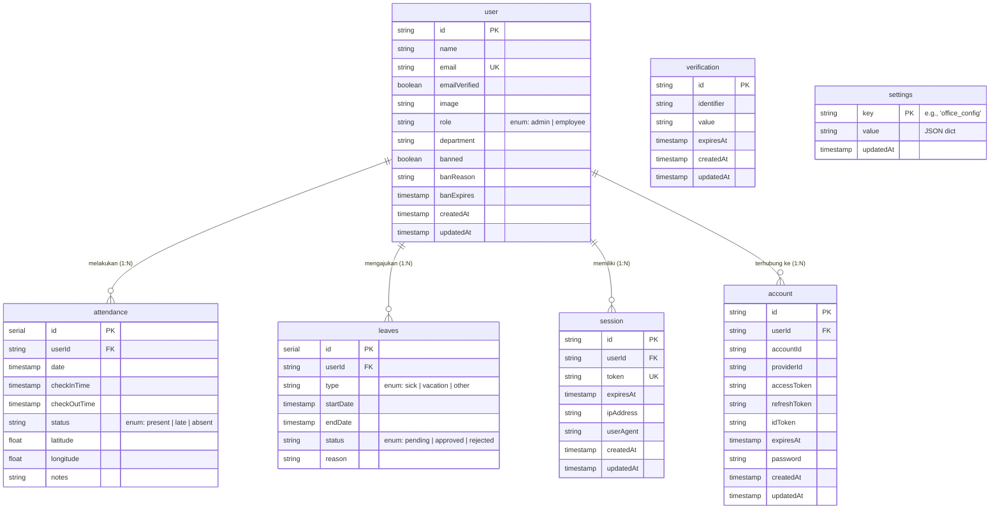

# Dokumen Perancangan Web App: Sistem E-Absensi Pegawai

Dokumen ini berisi penjelasan lengkap dan detail mengenai perancangan sistem aplikasi web **E-Absensi**. Aplikasi ini dirancang untuk memudahkan manajemen kehadiran karyawan menggunakan teknologi modern dengan fitur validasi lokasi (geofencing) dan waktu secara real-time.

---

## 1. Pendahuluan

**E-Absensi** adalah aplikasi manajemen sumber daya manusia berbasis web yang difokuskan pada pencatatan dan pemantauan kehadiran karyawan. Aplikasi ini dirancang untuk menggantikan sistem absensi manual atau mesin _fingerprint_ konvensional, memberikan fleksibilitas bagi karyawan (terutama yang bekerja di lapangan atau dengan sistem _hybrid_) serta kemudahan rekapitulasi bagi administrator (HRD/Manajemen).

### Tujuan Utama:
1. Memastikan validitas lokasi absensi menggunakan koordinat GPS (Geofencing).
2. Memudahkan karyawan dalam melakukan _clock-in_ (masuk), _clock-out_ (pulang), dan pengajuan cuti.
3. Memberikan _dashboard_ informatif bagi admin untuk memantau kehadiran, mengelola bawahan, dan menarik laporan otomatis.

---

## 2. Arsitektur Teknologi Dasar (Tech Stack)

Aplikasi ini dibangun menggunakan arsitektur *Fullstack* dalam satu *codebase* modern, dengan teknologi pilihan sebagai berikut:

*   **Framework Frontend & Backend:** **Next.js 15** (menggunakan *App Router*). Memungkinkan rendering yang cepat (SSR/SSG) dan pengelolaan API (melalui *Server Actions*) secara mulus.
*   **Bahasa Pemrograman:** **TypeScript**. Memberikan keamanan tipe data (*type safety*), mengurangi *bug* saat pengembangan.
*   **Database:** **PostgreSQL**. Database relasional yang tangguh, dikelola pemanggilannya menggunakan **Drizzle ORM** (Object-Relational Mapping).
*   **Autentikasi:** **Better Auth**. Library autentikasi modern yang menangani manajemen sesi, *login* terenkripsi (dengan modul `bcryptjs`), serta manajemen peran berbasis sesi (*session-based*).
*   **Styling & UI:** **Tailwind CSS v4** untuk styling utilitas cepat, dikombinasikan dengan komponen antarmuka pra-bangun dari **shadcn/ui** (seperti *Card*, *Button*, *Dialog*, *Table*, dll) dan ikon dari **Lucide React**.
*   **Peta & Geolokasi:** **Leaflet** & **React-Leaflet** untuk menampilkan *picker* peta pada *dashboard* admin (pengaturan koordinat kantor).

---

## 3. Struktur Database (Skema)

Skema database diimplementasikan menggunakan **Drizzle ORM** (`src/db/schema.ts`) dengan **PostgreSQL**. Berikut adalah representasi visual diagram relasi entitas (ERD) dan penjelasan dari masing-masing tabel:

### Diagram Relasi Entitas (ERD)



### Penjelasan Detail Tabel

#### A. Data Pengguna (`user`)
Tabel utama penyimpan identitas karyawan dan administrator.

| Kolom | Tipe Data | Deskripsi |
| :--- | :--- | :--- |
| **`id`** | Text (PK) | Identifier unik (UUID) pengguna |
| **`name`** | Text | Nama lengkap karyawan |
| **`email`** | Text (Unique) | Digunakan untuk otentikasi (login) |
| **`emailVerified`**| Boolean | Penanda status verifikasi alamat email |
| **`image`** | Text | URL foto profil pengguna |
| **`role`** | Enum | Berisi `'admin'` atau `'employee'` |
| **`department`** | Text | Divisi/Departemen tempat karyawan bekerja |
| **`banned`** | Boolean | Status diblokir (opsional manajemen sesi) |
| **`banReason`** | Text | Alasan akun pengguna diblokir |
| **`banExpires`** | Timestamp | Batas berakhirnya masa pemblokiran akun |
| **`createdAt`** | Timestamp | Waktu akun didaftarkan |
| **`updatedAt`** | Timestamp | Waktu pembaharuan profil terakhir |

#### B. Data Sesi Login (`session`)
Tabel dikelola oleh sistem _Better Auth_ untuk menyimpan status dan token login peramban pengguna.

| Kolom | Tipe Data | Deskripsi |
| :--- | :--- | :--- |
| **`id`** | Text (PK) | ID sesi login unik |
| **`userId`** | Text (FK) | Berelasi ke identitas tabel `user(id)` |
| **`token`** | Text (Unique) | Token rahasia _sessions_ yang tersimpan via _Cookies_ |
| **`expiresAt`** | Timestamp | Titik kedaluwarsa akses pengguna di perangkat tersebut |
| **`ipAddress`** | Text | IP Publik pengguna saat log in (Opsional) |
| **`userAgent`** | Text | Pengenalan perangkat atau _Browser_ yang dipakai (Opsional) |
| **`createdAt`** | Timestamp | Catatan waktu awal terjadinya log in |
| **`updatedAt`** | Timestamp | Modifikasi _session_ terakhir |

#### C. Data Kredensial Otentikasi (`account`)
Tabel pencatat kunci sandi _hash_ eksklusif di aplikasi mandiri, diubah dari _provider_ internal _Better Auth_.

| Kolom | Tipe Data | Deskripsi |
| :--- | :--- | :--- |
| **`id`** | Text (PK) | ID unik data akun pihak kredensial |
| **`userId`** | Text (FK) | Berelasi kepemilikan kembali ke tabel `user(id)` |
| **`accountId`** | Text | ID akun yang ditetapkan penyedia sumber |
| **`providerId`** | Text | Pengenal penyedia. (e.g. basis _credential_ lokal atau _google_) |
| **`accessToken`** | Text | Akses _Oauth Token_ eksternal |
| **`refreshToken`**| Text | Eksternal _Refresh Token_ untuk memperpanjang sesi |
| **`idToken`** | Text | Format duplikat internal data token |
| **`expiresAt`** | Timestamp | Masa tenggang koneksi antara _provider_ kredensial |
| **`password`** | Text | **Data penting penyimpan serangkaian _Hash Bcrypt_ dari sandi karyawan** |
| **`createdAt`** | Timestamp | Tanggal dan saat dicetaknya _provider credential_ pengguna |
| **`updatedAt`** | Timestamp | Saat perbaruan data akun kredensial berlangsung |

#### D. Verifikasi Sistem Khusus (`verification`)
Tabel _helper_ mandiri menampung kebutuhan sirkulasi keamanan email. (Pemulihan Password dan Konfirmasi Akun).

| Kolom | Tipe Data | Deskripsi |
| :--- | :--- | :--- |
| **`id`** | Text (PK) | ID proses pengajuan unik |
| **`identifier`**| Text | Referensi obyek utama penyebut seperti alamat surel (_email_) |
| **`value`** | Text | Parameter verifikasinya dapat berwujud tautan rahasia URL maupun OTP token singkat |
| **`expiresAt`** | Timestamp | Skala waktu penghancuran siklus verifikasi otomatis guna menjaga peretasan _link_ |
| **`createdAt`** | Timestamp | Tanggal dikirimkannya verifikasi otomatis |
| **`updatedAt`** | Timestamp | Deteksi interaksi dan modifikasi pengiriman manual |

#### E. Data Kehadiran (`attendance`)
Menyimpan riwayat _clock-in_ dan _clock-out_ dari masing-masing karyawan beserta validasi lokasi mereka.

| Kolom | Tipe Data | Deskripsi |
| :--- | :--- | :--- |
| **`id`** | Serial (PK) | ID auto-increment absensi |
| **`userId`** | Text (FK) | Berelasi ke tabel `user(id)` pelaksana rekam kegiatan |
| **`date`** | Timestamp | Pengelompokan absensi harian spesifik secara absolut |
| **`checkInTime`** | Timestamp | Waktu detik masuk presensi aktual |
| **`checkOutTime`**| Timestamp | Jam dan menit kepulangan aktual. *NULL/Kosong* bermakna statusnya belum _Clock Out_ |
| **`status`** | Enum | Status kehadiran konstan: `'present'`, `'late'`, atau `'absent'` |
| **`latitude`** | Float | Garis lintang koordinat terdeteksi satelit GPS (_navigator_) saat absen masuk awal |
| **`longitude`** | Float | Garis bujur koordinat akurat (_navigator_) saat awal absen masuk terjadi |
| **`notes`** | Text | Ekstra keterangan atau log anomali pencatat (Opsional) |

#### F. Data Permohonan Cuti (`leaves`)
Menyimpan pencatatan permohonan absen berizin atau sakit dan proses eskalasi hierarkinya.

| Kolom | Tipe Data | Deskripsi |
| :--- | :--- | :--- |
| **`id`** | Serial (PK) | ID auto-increment cuti |
| **`userId`** | Text (FK) | Pemohon (relasi ke profil identitas `user(id)`) |
| **`type`** | Enum | Tipe izin klasifikasi standar manajemen: `'sick'`, `'vacation'`, atau `'other'` |
| **`startDate`** | Timestamp | Rentang kalender hari mulainya libur/izin |
| **`endDate`** | Timestamp | Berakhir kalender usainya izin berlangsung |
| **`status`** | Enum | Kondisi sirkulasi: `'pending'` (menunggu disetujui instan/manual), `'approved'`, atau `'rejected'` |
| **`reason`** | Text | Alasan deskriptif subyektif oleh partisipan karyawan |

#### G. Pengaturan Global Administratif (`settings`)
Menyimpan data konfigurasi global, dikaitkan tanpa batas dalam wujud skema properti parameter dinamis (menyelamatkan integrasi dan pengembangannya).

| Kolom | Tipe Data | Deskripsi |
| :--- | :--- | :--- |
| **`key`** | Text (PK) | Kunci akses konfigurasi internal aplikasi. (Contoh spesifik: `"office_config"`) |
| **`value`** | Text | Rangkaian teks _String JSON Stringified_ yang dapat menampung susunan hirarki ganda (Obyek berisi koordinat garis lintang bujur titik lokasi dan persentase numerik batas toleransi radius) |
| **`updatedAt`** | Timestamp | Parameter perubahan revisi konfigurasi administrator terakhir kali berjalan |

---

## 4. Alur & Logika Bisnis Utama

Bagian ini adalah inti dari aplikasi E-Absensi.

### A. Mekanisme Geofencing (Validasi Jarak)
Aplikasi memastikan karyawan benar-benar berada di sekitar area kantor sebelum memperbolehkan tombol "Clock In / Clock Out" memproses data ke database.
1.  **Pengecekan Kordinat:** Saat tombol diklik, _browser_ menggunakan `navigator.geolocation` milik perangkat untuk mendapatkan garis lintang & bujur karyawan saat itu.
2.  **Perhitungan Haversine:** Sebuah rumus matematika di `lib/geolocation/index.ts` menghitung jarak antara lokasi karyawan dengan *Lokasi Kantor* (diambil dari tabel `settings`).
3.  **Validasi Radius**: Jika mode "Geofencing" diaktifkan oleh admin, dan jarak perhitungannya melebihi "Radius" yang ditetapkan (misal 100 meter), *Server Action* akan langsung menolak kehadiran dengan status "Di Luar Jangkauan Kantor".

### B. Alur Absensi (Masuk & Pulang)
Berada di dalam layar _Dashboard_ Karyawan (`src/app/dashboard/page.tsx`).
*   **Cek Harian**: Setiap kali halaman dibuka, sistem akan memanggil API `getTodayUserAttendance()`.
*   Sistem melihat tabel `attendance` untuk karyawan *tersebut* pada *hari ini*.
    *   Jika **belum ada data**, layar akan memunculkan tombol raksasa hijau: **CLOCK IN**.
    *   Jika **sudah Clock In tapi belum Clock Out**, layar akan menampilkan status sedang bekerja, jam masuknya, dan tombol memerah berubah menjadi: **CLOCK OUT**.
    *   Jika **sudah Clock In & Clock Out**, seluruh tombol dinonaktifkan dengan status "Sudah menyelesaikan absensi hari ini".

### C. Manajemen Karyawan (Admin)
Berada di dalam layar _Dashboard_ Admin bagian *Employees* (`src/app/(admin)/admin/employees`).
*   Hanya pengguna dengan `role: "admin"` yang bisa membuat akun baru (pendaftar mandiri via halaman `/sign-up` dinonaktifkan secara *default* dari keamanan).
*   Admin membuat akun dengan mengisi Nama, Email, Password, Peran, dan Departemen (`actions/user.ts -> createUser`).
*   Admin bisa melakukan operasi "Hapus" akun yang secara otomatis (*cascade delete*) akan membersihkan semua riwayat absensi dan sesi cutinya tanpa _error constraint_.

### D. Alur Cuti Karyawan
Karyawan membuka menu *Leave* (`src/app/dashboard/leave/page.tsx`).
1. Karyawan memilih tipe cuti, tanggal mulai, tanggal selesai, dan memasukkan alasan.
2. Logika `actions/leave.ts -> requestLeave` dipanggil menaruh status `'pending'`.
3. Admin melihat semua daftar pengajuan di menu *Leave Admin*.
4. Admin dapat menekan tombol *Terima* (`'approved'`) atau *Tolak* (`'rejected'`), yang seketika *me-refresh* status milik karyawan menjadi hijau/merah.

---

## 5. Struktur Direktori Proyek

Aplikasi dikelompokkan dengan pola dan konvensi *Next.js App Router* yang tegas:

```bash
📦 src/
 ┣ 📂 actions/        # (Backend) Logic untuk menyuntik / mengambil data (Server Actions).
 ┃ ┣ 📜 attendance.ts # Logika Clock In, Clock Out, Tarik Laporan Hadir.
 ┃ ┣ 📜 leave.ts      # Pengajuan cuti, Approval Cuti.
 ┃ ┣ 📜 settings.ts   # Setting lokasi GPS kantor.
 ┃ ┗ 📜 user.ts       # CRUD dan Password Reset Karyawan.
 ┣ 📂 app/            # (Frontend) Seluruh halaman (Routing).
 ┃ ┣ 📂 (admin)/      # Route Group: Area Khusus Administrator.
 ┃ ┣ 📂 (auth)/       # Route Group: Halaman Login & Redirect Sign-Up.
 ┃ ┣ 📂 dashboard/    # Route Group: Area Karyawan Biasa.
 ┃ ┣ 📜 layout.tsx    # Root HTML & Intervensi UI global (seperti Toast Notification).
 ┃ ┗ 📜 page.tsx      # Routing awal saat buka web (Mengarahkan ke Admin/Karyawan/Login).
 ┣ 📂 components/     # Elemen UI yang digunakan berulang kali.
 ┃ ┣ 📂 layout/       # Rangka UI seperti Navbar, Sidebar, Mobile Navigation.
 ┃ ┣ 📂 ui/           # Elemen Atomik (Tombol, Form, Alert) buatan shadcn/ui.
 ┃ ┗ ...
 ┣ 📂 db/             # Inti pengolahan PostgreSQL.
 ┃ ┣ 📜 index.ts      # Instansiasi & sambungan ke Database.
 ┃ ┗ 📜 schema.ts     # Seluruh cetak biru / blue print tabel / kolom.
 ┗ 📂 lib/            # Fungsi utilitas tanpa interface UI.
   ┣ 📜 auth.ts       # Regulasi Better Auth (secret, session management).
   ┣ 📂 geolocation/  # Rumus matematika geolacting (Haversine).
   ┗ 📜 utils.ts      # Fungsi kecil seperti format tanggal & penggabungan nama class.
```

---

## 6. Sisten Keamanan Aplikasi (Security Design)

Dalam membuat aplikasi Enterprise kecil-menengah ini, keamanan diimplementasikan pada lapisan berulang:
1.  **Proteksi Komponen (Client-Side & Server-Side):**
    *   Halaman layout `/dashboard` akan diredirect kembali ke `/login` jika tidak ada *session cookie* karyawan.
    *   Halaman layout `/admin` mengecek secara kuat bahwa variabel `session.user.role === 'admin'`. Jika tidak, karyawan 'nakal' akan dilempar kembali ke dasbord pengguna standar.
2.  **Database Level & Server Action (Backend Protection):**
    *   Setiap file di dalam folder `src/actions/` selalu diawali pengecekan sesi kembali. Ini mencegah seseorang memanggil API secara manual melalui _Postman_ atau manipulasi JS tanpa login yang sah.
3.  **Halaman Otentikasi Terkontrol:**
    *   Membatasi publik mendaftar sembarangan. Registrasi dikendalikan secara mutlak dan manual oleh Admin lewat dashboard bawaannya.

## Ringkasan

Dengan rancangan di atas, **E-Absensi** menawarkan solusi yang handal, cepat (menggunakan standard Server-Side Rendering mutakhir), interaktif, dan aman. Validasi kehadiran dan lokasi disandarkan ke sisi _server logic_, sehingga sangat meminimalisir peluang karyawan memanipulasi _client_ (seperti mengubah jam komputer lokal atau manipulasi data ringan).
